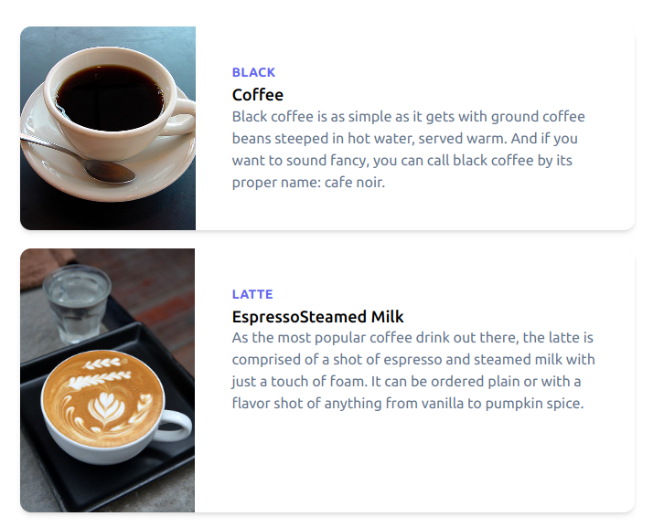

## Tecnologias usadas: tailwind e React, react-routes, REact-routes
## para usar bastar fazer um clone, digitar npm i, digitar npm start

# versão 1 - 
## consumo de api externa
## visualizar informações

# versão 2 - 
## consumo de 2 apis externa 
## visualizar informações
## visualizar detalhes
## filtro

